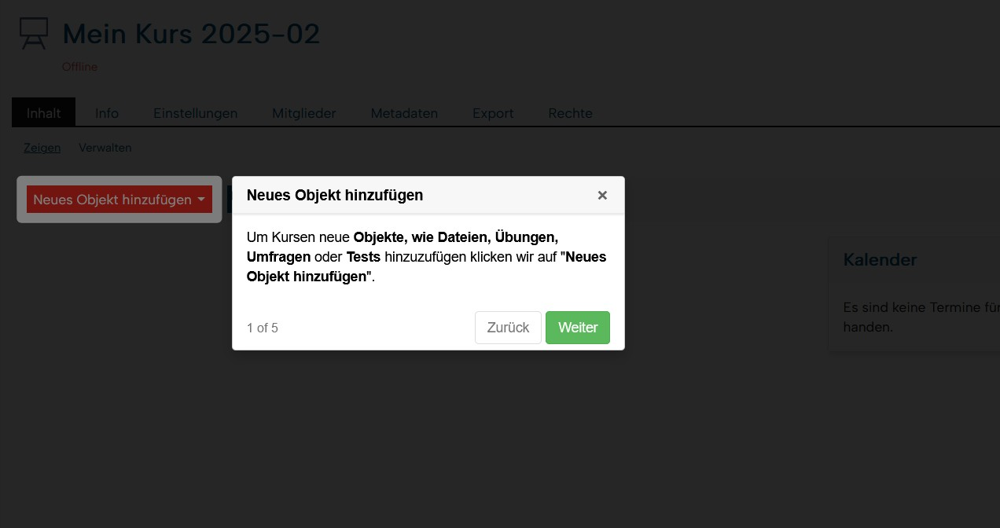
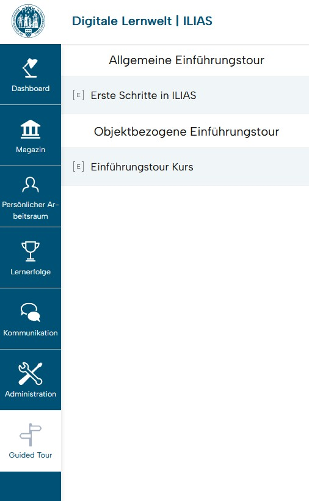
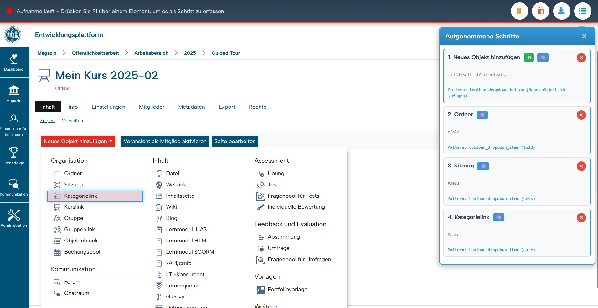
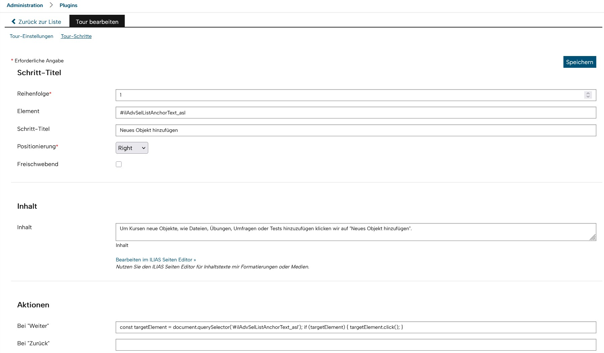
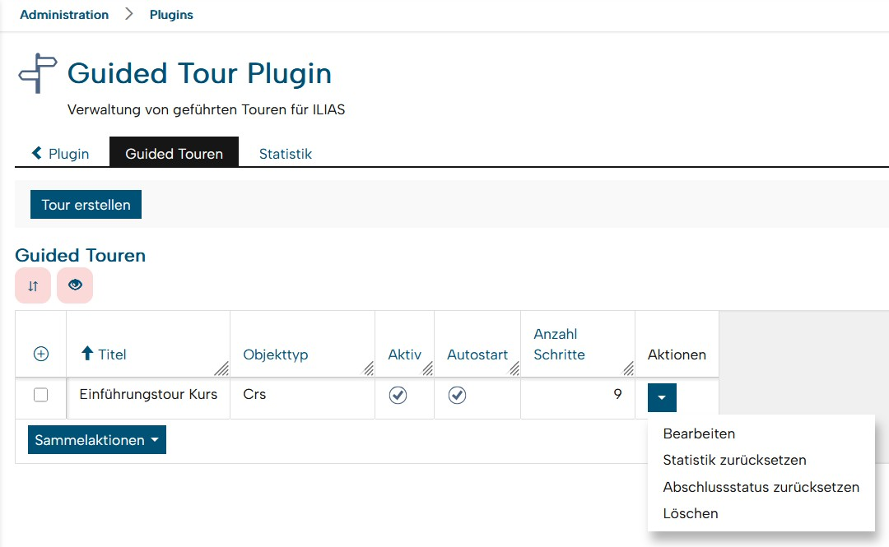
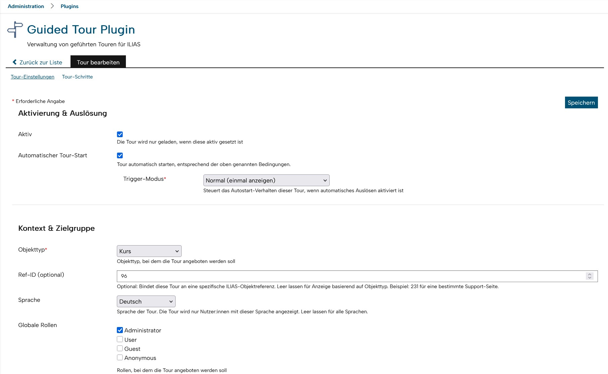
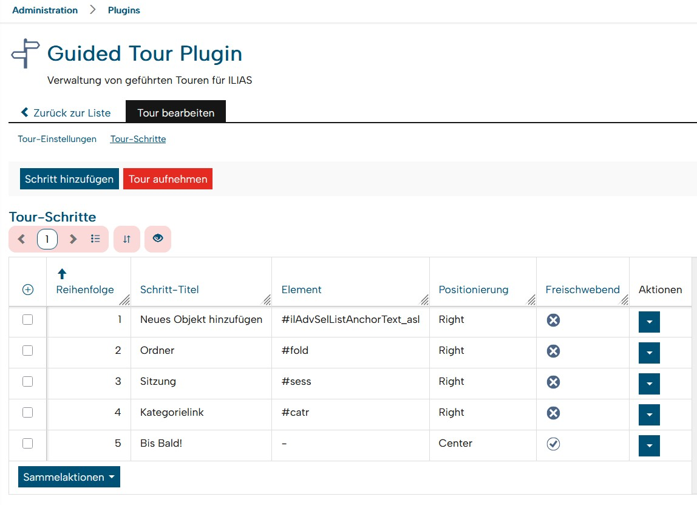
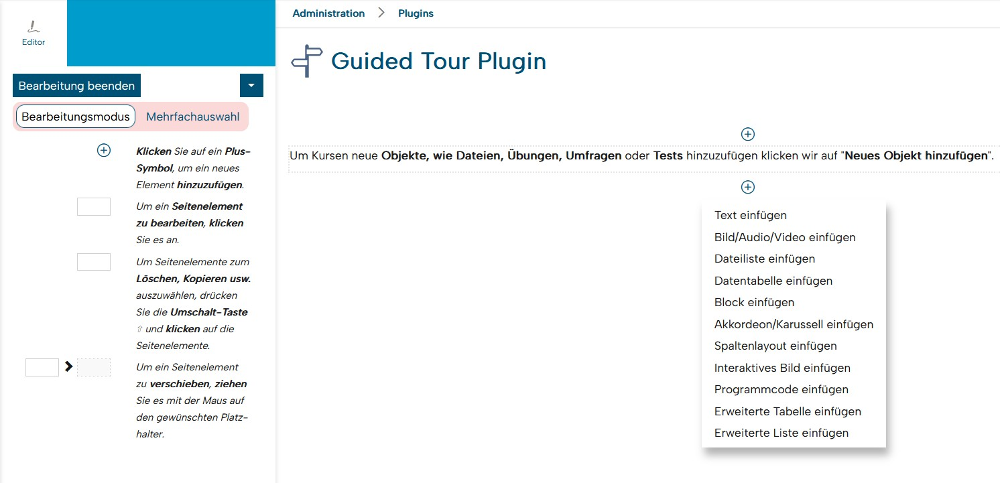

# GuidedTour Plugin for ILIAS

[](https://www.ilias.de)
[](https://www.php.net)
[](LICENSE)

**Interactive guided tours for ILIAS LMS**

A comprehensive plugin for creating context-sensitive, role-based guided tours to onboard users and provide interactive help within ILIAS.

Developed by the [Competence Center E-Learning, University of Cologne](https://www.portal.uni-koeln.de/ccl)

---

## Screenshots

<table>
  <tr>
    <td width="50%">
      
      <p align="center"><em>Interactive tour in action</em></p>
    </td>
    <td width="50%">
      
      <p align="center"><em>Tours accessible from main menu</em></p>
    </td>
  </tr>
  <tr>
    <td width="50%">
      
      <p align="center"><em>Live recording mode (F1 to capture elements)</em></p>
    </td>
    <td width="50%">
      
      <p align="center"><em>Visual step editor with all options</em></p>
    </td>
  </tr>
</table>

---

## Table of Contents

- [Features](#features)
- [Requirements](#requirements)
- [Installation](#installation)
- [Configuration](#configuration)
- [Usage](#usage)
  - [Creating Tours](#creating-tours)
  - [Step Management](#step-management)
  - [Recording Tours](#recording-tours)
  - [Trigger Modes](#trigger-modes)
  - [Context Targeting](#context-targeting)
- [Statistics](#statistics)
- [Technical Details](#technical-details)
- [Migration from Bootstrap Tourist](#migration-from-bootstrap-tourist)
- [Development](#development)
- [License](#license)
- [Support](#support)

---

## Features

### Core Functionality
- **Interactive Step-by-Step Tours**: Guide users through ILIAS with highlighted elements and contextual information
- **Multiple Creation Methods**:
  - Visual step-by-step editor
  - Live recording mode (F1 to capture elements)
  - Direct JSON scripting for advanced use cases (Legacy Support)
- **ILIAS Page Editor Support**: ILIAS Page Editor integration for formatted content with images and media
- **Context-Sensitive Display**: Show tours based on object type, specific ref-IDs, roles or language

### Advanced Targeting
- **Role-Based Access**: Assign tours to specific global roles
- **Language-Specific Tours**: Create tours for specific languages or all languages
- **Ref-ID Binding**: Bind tours to specific ILIAS objects (e.g., support page, specific course)
- **Type-Based Filtering**: Show tours only in specific contexts (dashboard, courses, groups, tests, etc.)

### Automatic-Trigger Modes (Tour Autostart)
- **Normal Mode**: Show tour once per user
- **Always Mode**: Show tour every time user visits the context (useful for reminders/help)
- **Until Completed**: Keep showing tour until user reaches the last step (onboarding)

### User Experience
- **Main Menu Integration**: Tours accessible via dedicated main menu entry
- **Automatic Triggering**: Tours can start automatically based on context
- **Manual Triggering**: Users can start tours via URL parameter (`?triggerTour=gtour-{id}`) [3rd party interface]
- **Progress Tracking**: Server-side tracking of user progress and completion
- **Responsive Design**: Works on desktop and mobile devices

### Analytics & Administration
- **Comprehensive Statistics**:
  - Total starts and unique users
  - Completion rates
  - Average step reached
  - Activity over time (7/30 days)
  - Per-tour comparison
- **User State Management**: Track users tour state (tour started / completed / last step / tour restarts / max. reached tour step)
- **Reset Options**: Reset statistics or completion status per tour or globally

### Modern Technology Stack
- **Driver.js Framework**: Lightweight, modern JavaScript library (MIT license)
- **No Dependencies**: Zero further external dependencies for maximum compatibility
- **ILIAS 9 UI Components**: Modern form components with optimal groups and sections

---

## Requirements

- **ILIAS**: Version 8.0 - 9.999
- **PHP**: Version 8.1 or higher
- **Database**: MySQL/MariaDB (managed via ILIAS database abstraction)
- **Browser**: Modern browser with JavaScript enabled

---

## Installation

### Method 1: Download via ZIP

1. Download the latest release as ZIP file
2. Navigate to your ILIAS root directory
3. Run the following commands:

```bash
mkdir -p Customizing/global/plugins/Services/UIComponent/UserInterfaceHook/GuidedTour
cd Customizing/global/plugins/Services/UIComponent/UserInterfaceHook/GuidedTour
unzip path/to/gtour.zip
```

4. In ILIAS, navigate to: **Administration → Extending ILIAS → Plugins**
5. Find "GuidedTour" in the list and click **Update** (if upgrading) or **Activate**

### Method 2: Download via Git

```bash
cd /path/to/ilias
mkdir -p Customizing/global/plugins/Services/UIComponent/UserInterfaceHook
cd Customizing/global/plugins/Services/UIComponent/UserInterfaceHook
git clone https://github.com/cce-uzk/GuidedTourPlugin.git GuidedTour
```

Then activate via ILIAS Plugin Administration.

### Updating the Plugin

```bash
cd Customizing/global/plugins/Services/UIComponent/UserInterfaceHook/GuidedTour
git pull
```

Then update via ILIAS Plugin Administration.

**Important**: Always update via the ILIAS Plugin Administration interface to run database migrations.

---

## Configuration

Access the plugin configuration via:
**Administration → Extending ILIAS → Plugins → GuidedTour → Configure**

### Main Interface

The configuration interface provides three main tabs:
- **Guided Tours**: Manage all tours (create, edit, activate, delete)
- **Statistics**: View usage analytics and completion rates
- **Tour Settings** (when editing): Configure individual tour settings and steps


*Tour management interface with activation, editing and statistics*

---

## Usage

### Creating Tours

1. Navigate to the plugin configuration
2. Click **Create Tour**
3. Configure the tour in four sections:

#### Section 1: Activation & Trigger
- **Active**: Enable/disable the tour
- **Automatic Trigger**: Enable to show tour automatically
  - **Trigger Mode** (only shown when automatic trigger is enabled):
    - `Normal`: Show once per user
    - `Always`: Show every time
    - `Until Completed`: Show until user finishes

#### Section 2: Context & Target Group
- **Object Type**: Where to show the tour (Global, Course, Group, Test, etc.)
- **Ref-ID** (optional): Bind tour to specific ILIAS object (e.g., `231` for a support page)
- **Language**: Restrict to specific language or show for all languages
- **Global Roles**: Select which roles can see this tour

#### Section 3: Content & Information
- **Title**: Display name in main menu
- **Description**: Public description for users
- **Scenario**: Internal notes for administrators

#### Section 4: Tour Script (Legacy Support - We recommend record mode or visual step editing)
- **Script**: JSON definition of tour steps (used when not using step editor)


*Tour configuration form with four organized sections*

### Step Management

After creating a tour, switch to the **Steps** tab to manage tour content.


*Step overview with drag & drop ordering and quick access to recording mode*

#### Visual Step Editor

1. Click **Add Step** to create a new step
2. Configure each step:
   - **Title**: Step headline
   - **Element**: CSS selector (e.g., `.il-mainbar`, `#element-id`)
   - **Content**: Step description (plain text)
   - **Rich Content**: Enable to use ILIAS Page Editor with images and formatting
   - **Placement**: Position of popover (right, left, top, bottom)
   - **Orphan**: Show step in center without element binding
   - **Actions**: JavaScript to execute on show/hide/next/prev
   - **Path**: Multi-page tours (navigate to different pages)

3. Drag & drop to reorder steps
4. Steps are automatically saved with sort order

#### Rich Content with Page Editor

When **Rich Content** is enabled:
- Full ILIAS Page Editor available
- Insert images, videos, formatted text
- Create complex layouts
- Content stored separately from JSON


*Rich content editing with full ILIAS Page Editor capabilities*

### Recording Tours

The recording feature allows you to capture tour steps by interacting with the interface.

1. Edit a tour and switch to **Steps** tab
2. Click **Record Tour**
3. Press **F1** while hovering over any element to capture it
4. For each captured element:
   - Add title and description in the popup
   - Optionally click the element to register a click action
5. Click **Save & Exit** to save all recorded steps

**Recording Features**:
- Steps stored in browser memory during recording
- Pause/Resume recording
- Show/Hide list of captured steps
- Discard recording to start over
- Click registration (2-second window after F1)

### Trigger Modes

Configure how tours are shown to users:

#### Normal Mode (Default)
```
User visits context → Tour shows once → Marked as seen → Won't show again
```
Use for: One-time onboarding, announcements

#### Always Mode
```
User visits context → Tour shows → User closes → Next visit: Tour shows again
```
Use for: Help/reminder tours, optional guidance

#### Until Completed Mode
```
User visits context → Tour shows → User closes without finishing → Next visit: Shows again
User visits context → Tour shows → User completes → Won't show again
```
Use for: Required onboarding, training paths

### Context Targeting

Tours can be targeted to specific contexts:

#### Type-Based Targeting
Show tours only in specific object types:
- `any` (Global): Show everywhere
- `crs` (Course): Only in courses
- `grp` (Group): Only in groups
- `tst` (Test): Only in tests
- `ildashboardgui`: Only on dashboard
- `ilmembershipoverviewgui`: Only in "Courses and Groups"

#### Ref-ID-Based Targeting
Bind tours to specific ILIAS objects:
```
Type: any (or specific type)
Ref-ID: 231

→ Tour shows only when ref_id=231 in URL
```

Use cases:
- Support page tours (ref_id of support page)
- Specific course tours
- Object-specific help

#### Combined Targeting
```
Type: crs
Ref-ID: 123
Language: de
Roles: [4 (User)]

→ Shows only in course with ref_id=123, for German-speaking users with "User" role
```

### Manual Tour Triggering

Tours can be manually triggered via URL parameter:
```
https://ilias.example.com/goto.php?target=crs_123&triggerTour=gtour-5
```

Replace `5` with your tour ID. This bypasses all automatic trigger logic and shows the tour immediately.

---

## Statistics

Access comprehensive analytics via the **Statistics** tab.

### Available Metrics

**Per Tour Statistics**:
- Total starts
- Unique users who started
- Completion count
- Partial completion count
- Average step reached
- Completion rate (%)
- First and last usage timestamps
- Activity in last 7/30 days

**Comparison View**:
- Compare all tours side-by-side
- Total starts comparison
- Completion rate comparison
- Average step comparison

### Data Management

**Reset Statistics**:
- Deletes all historical data for selected tour
- Irreversible action
- Useful for testing or after major tour changes

**Reset Completion Status**:
- Marks tour as "not seen" for all users
- Preserves historical statistics
- Allows tour to show again (respects trigger mode)

---

## Technical Details

### Database Schema

The plugin manages four main tables:

#### `gtour_tours`
Main tour configuration
- `tour_id`: Primary key
- `title`, `type`, `ref_id`: Targeting configuration
- `is_active`, `is_automatic_triggered`: Activation flags
- `trigger_mode`: Trigger behavior (normal/always/until_completed)
- `language_code`: Language restriction
- `roles_ids`: JSON array of allowed role IDs
- `script`: JSON tour definition
- `icon_id`: Resource storage identifier

#### `gtour_steps`
Step-by-step definitions
- `step_id`: Primary key
- `tour_id`: Foreign key to tours
- `sort_order`: Display order
- `element`, `title`, `content`: Step configuration
- `placement`, `orphan`: Display options
- `on_next`, `on_prev`, `on_show`, `on_hide`: Action hooks
- `content_page_id`: Link to ILIAS page object (rich content)
- `element_type`, `element_name`: Smart pattern recognition

#### `gtour_user_state`
Current user state per tour
- Primary key: `(tour_id, user_id)`
- `last_started_ts`, `last_terminated_ts`: Session tracking
- `last_step_reached`: Progress tracking (0-based index)
- `times_started`, `times_completed`: Counters
- `show_again`: Flag for trigger mode logic

#### `gtour_usage_history`
Historical tracking of all tour runs
- `id`: Primary key (sequence)
- `tour_id`, `user_id`: User/tour combination
- `started_ts`, `terminated_ts`: Session timestamps
- `last_step_reached`: Furthest step in this session

### Architecture

**Component Type**: UIHook Plugin
**Hook Points**:
- `ilUIHookPluginGUI`: Inject tour initialization into every page
- `AbstractStaticMainMenuPluginProvider`: Add tours to main menu

**JavaScript Integration**:
- Driver.js loaded on demand (not on mobile devices)
- Tour configuration injected via `addOnloadCode()`
- AJAX endpoints for progress tracking (`updateProgress`, `terminateTour`)

**Page Editor Integration**:
- Custom page object type: `gtst` (Guided Tour Step)
- Component: `plugin/gtour`
- Page GUI: `ilGuidedTourStepPageGUI`
- Registered in `copg_pobj_def` table

### Completion Logic

Completion determined by:
```php
$is_completed = $last_step_reached >= ($total_steps - 1);
```

- Steps are 0-indexed internally
- Completion increments `times_completed` counter
- Termination always updates `last_terminated_ts`

### JSON Script Format (Legacy Support - We recommend record mode or visual step editing)

For manual scripting:

```json
[
  {
    "element": ".il-mainbar",
    "popover": {
      "title": "Welcome",
      "description": "This is the main navigation bar."
    },
    "popover.side": "right"
  },
  {
    "element": "#mm_search_button",
    "popover": {
      "title": "Search",
      "description": "Use this to search ILIAS."
    }
  }
]
```

**Driver.js Options**: See [Driver.js Documentation](https://driverjs.com/docs/configuration)

**ILIAS Helper Functions**:
```javascript
// Element selection
il.Plugins.GuidedTour.getMainbarElementByIndex(index);
il.Plugins.GuidedTour.getSlateElementByIndex(index);
il.Plugins.GuidedTour.getTabElementByIndex(index);
il.Plugins.GuidedTour.getSubTabElementByIndex(index);

// Actions
il.Plugins.GuidedTour.clickMainbarElementByIndex(index);
il.Plugins.GuidedTour.clickSlateElementByIndex(index);
il.Plugins.GuidedTour.clickTabElementByIndex(index);
il.Plugins.GuidedTour.clickSubTabElementByIndex(index);
il.Plugins.GuidedTour.goTo('url');

// State checks
il.Plugins.GuidedTour.isMainBarElementCollapsed(index);
```

---

## Migration from Bootstrap Tourist

This plugin previously used **Bootstrap Tourist** (a fork of Bootstrap Tour), which:
- Has not been updated since 2021
- Contains security vulnerabilities (`eval`, `new Function`)
- Requires jQuery and Bootstrap 3/4
- Has unclear open-source licensing

**Driver.js** provides the same functionality with:
- ✅ Better security (no dynamic code execution)
- ✅ Modern JavaScript (ES6+, TypeScript)
- ✅ Zero external dependencies
- ✅ Clear MIT license (commercially usable)
- ✅ Active maintenance
- ✅ Better performance (~5kb gzipped)

### Compatibility

The plugin **automatically converts** old Bootstrap Tourist JSON to Driver.js format:
- Existing tours continue to work
- `title` → `popover.title`
- `content` → `popover.description`
- Callbacks preserved where possible

New tours should use native Driver.js options for best results.

---

## Development

### Project Structure

```
GuidedTour/
├── classes/                    # PHP classes
│   ├── Data/                  # Repositories
│   │   ├── GuidedTourRepository.php
│   │   ├── GuidedTourStepRepository.php
│   │   └── GuidedTourUserFinishedRepository.php
│   ├── Model/                 # Domain models
│   │   ├── GuidedTour.php
│   │   └── GuidedTourStep.php
│   ├── Page/                  # Page editor integration
│   ├── Recording/             # Recording feature
│   ├── Table/                 # ILIAS tables
│   ├── MainBar/               # Main menu provider
│   ├── class.ilGuidedTourConfigGUI.php
│   ├── class.ilGuidedTourGUI.php
│   ├── class.ilGuidedTourUIHookGUI.php
│   └── class.ilGuidedTourPlugin.php
├── js/                        # JavaScript
│   └── main.js               # Tour initialization & Driver.js integration
├── css/                       # Custom styles
├── sql/                       # Database migrations
│   └── dbupdate.php          # 12 migration steps
├── lang/                      # Language files
│   ├── ilias_en.lang
│   └── ilias_de.lang
├── templates/                 # HTML templates & assets
├── vendor/                    # Dependencies
│   └── driver.js/            # Driver.js library (v1.3.1)
├── plugin.php                # Plugin metadata
└── README.md                 # This file
```

### Database Migrations

Migration steps are managed in `sql/dbupdate.php` and will be executed with plugin update.

### Key Classes

**ilGuidedTourPlugin**: Main plugin class, singleton pattern
**ilGuidedTourConfigGUI**: Admin interface (modern ILIAS UI Controls)
**ilGuidedTourUIHookGUI**: Page injection & autostart logic
**ilGuidedTourGUI**: AJAX endpoints for progress tracking
**GuidedTourMainBarProvider**: Main menu integration

**GuidedTourRepository**: Tour CRUD operations
**GuidedTourStepRepository**: Step management
**GuidedTourUserFinishedRepository**: State & statistics tracking

### Extending the Plugin

**Add new trigger mode**:
1. Add constant to `GuidedTour::TRIGGER_MODES`
2. Update `setTerminated()` logic in `GuidedTourUserFinishedRepository`
3. Add language strings
4. Update form in `ilGuidedTourConfigGUI`

**Add new context type**:
1. Add to `GuidedTour::TYPES`
2. Add language string `tour_type_{type}`
3. Context matching is automatic via `getContextObjType()` or `getCmdClass()`

---

## License

This plugin is licensed under the **GNU General Public License v3.0**.

See [LICENSE](LICENSE) file for details.

**Third-Party Libraries**:
- **Driver.js** (MIT License) - Copyright (c) 2024 Kamran Ahmed

---

## Support

### Reporting Issues

Please report bugs and feature requests via:
- **GitHub Issues**: [https://github.com/cce-uzk/GuidedTourPlugin/issues](https://github.com/cce-uzk/GuidedTourPlugin/issues)

When reporting bugs, please include:
- ILIAS version
- PHP version
- Plugin version
- Browser and version
- Steps to reproduce
- Expected vs. actual behavior

### Contact

**Developer**: Nadimo Staszak
**Email**: nadimo.staszak@uni-koeln.de
**Institution**: Competence Center E-Learning, University of Cologne

### Contributing

Contributions are welcome! Please:
1. Fork the repository
2. Create a feature branch (`git checkout -b feature/amazing-feature`)
3. Commit your changes (`git commit -m 'Add amazing feature'`)
4. Push to the branch (`git push origin feature/amazing-feature`)
5. Open a Pull Request

---

## Changelog

### Version 2.7.0 (2025)
- **New**: Ref-ID binding for object-specific tours
- **New**: Trigger modes (normal, always, until_completed)
- **Improvement**: Modern ILIAS UI Controls
- **New**: Completion tracking now distinguishes between "terminated" and "completed"
- **Fix**: Autostart context matching improved with ref_id fallback
- **Statistics**: Accurate completion rates based on step progress
- **New**: Step-by-step editor with drag & drop
- **New**: Recording mode (F1 to capture elements)
- **New**: ILIAS Page Editor integration for rich content
- **New**: Comprehensive statistics dashboard
- **Refactoring**: Two-table system (state + history)
- **Migration**: Bootstrap Tourist → Driver.js

### Earlier Versions
See [GitHub Releases](https://github.com/cce-uzk/GuidedTourPlugin/releases) for full history.

---

**Made with ❤️ at the University of Cologne**
